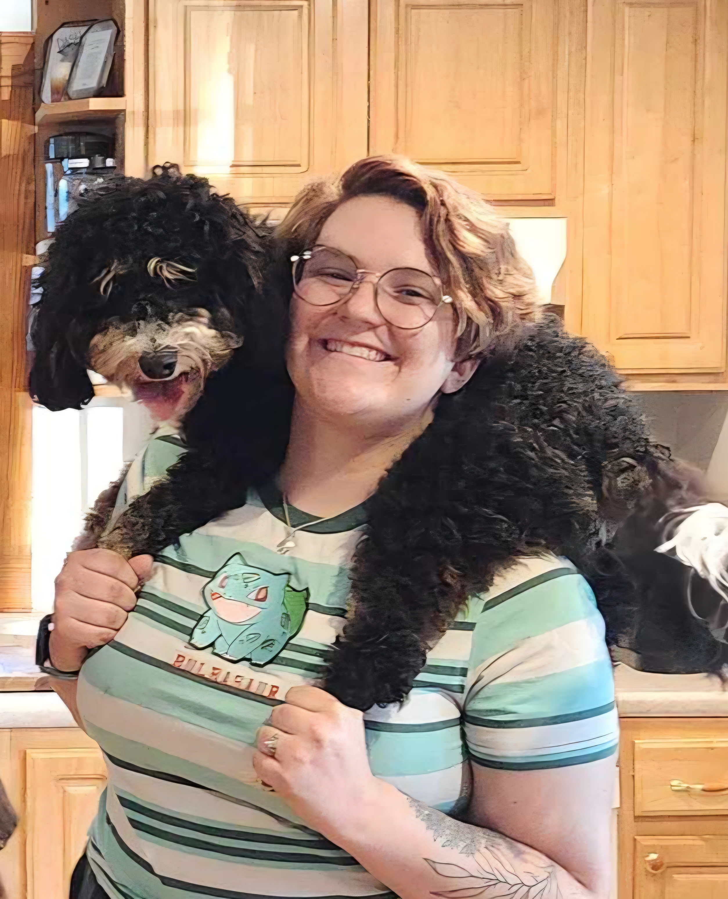

&nbsp; #Learning Fellow  
&nbsp; ~SNHU MAT-241  
&nbsp; #Mobility Technician  
&nbsp; ~Elliot Hospital  
&nbsp; &nbsp; email: natalie.dovale@snhu.edu 
&nbsp; &nbsp; [Resume](https://docs.google.com/document/d/14Z6EaGyPkXhglJOP3bw3A3wkWA113if3x3NgrTIWwkE/edit?usp=sharing)
 
 

### About Me
I am an Undergraduate Biology Student at SNHU with prior coursework at Nova Southeastern University. I am a full-time student focusing on a pre-medical school concentration while also working two jobs. I work part-time at SNHU as a Learning Fellow for the MAT-241 class: Modern Statistics w/ Coding. I also work Per-deim as a Mobility Technician at Elliot Hospital. My duties at Elliot Hospital include assisting and motivating patients to mobilize during their inpatient hospital stay, helping with patient transfers, and following physical therapy activity orders. In my free time, I enjoy painting, playing video games, cooking, and spending time with my dog and family.
 

### Past Projects
#### [Palmer Penguins Data Analysis](https://github.com/Leedahbee/BioStatisticsAnalysis/blob/main/Palmer%20Penguins%20v2.html.md)  
&nbsp; &nbsp; &nbsp;My first foray into coding and BioStatistcs. Using the Palmer Penguins data set to understand how to code using R to make data tables, charts, and graphs. The Palmer Penguins dataset includes penguin population data from three islands, covering several factors such as species, sex, bill lengths and depths, and flipper length. Other than learning more about how to use r as a coding language I also was curious whether the data set included any significant outliers, and addressed this question using the knowlege learned from the data analysis in the earlier part of the project.
 

#### [Dog Breeds Biostatistical Analysis](https://github.com/Leedahbee/BioStatisticsAnalysis/blob/main/Dog%20Breeds%20Biostats.qmd)  
&nbsp; &nbsp; &nbsp; Little Dog Syndrome and Large Dogs as Gentle Giants? This Analysis seeks to determine if there is any evidence in the dataset that the trait scores of large and small breeds align with the stereotypes. Using charts and tables to support conclusions and an in-depth analysis of hundreds of dog breeds on traits such as how good they are with children and other dogs, their barking level, and their trainability. Also includes an additional analysis of the possible bias in the data set due to troubling trends identified during the main analysis.
 

#### [RNA-seq Part 1](https://github.com/Leedahbee/BioInformatics-/blob/main/RNA%20Seq%20FINAL.qmd)  
&nbsp; &nbsp; &nbsp; RNA-seq is a burgeoning new genetic technique used to better understand organisms through RNA quantification. Using high-throughput sequencing methods, the RNA of a whole species or specific genes thereof can be quantified by their expression levels. This particular analysis examines the expression of 15,000 genes in the organism _Drosophila melanogaster_. In particular, looking at the difference in gene expression between the first and second instars. It was determined that several genes related to the epidermis in various areas of the organism are expressed differently at different stages of embryonic development.
 

#### [RNA-seq Part 2](https://github.com/Leedahbee/BioInformatics-/blob/main/RNA%20Seq%20dos.qmd)  
&nbsp; &nbsp; &nbsp; Building on the ideas and techniques learned in Part 1 of the RNA-seq project, the model plant _Arabidopsis_ was used to create a heatmap. The resulting heatmap was used to better visualize the different gene expression patterns in the plant RNA. It was noted that there may be an inverse relationship between genes 2 and 3, particularly in the plant root, due to the difference in log(TPM) values between the two genes.
 

#### [Phyolgenetic Analysis](https://github.com/Leedahbee/BioInformatics-/blob/main/Phylogenetics.qmd)  
&nbsp; &nbsp; &nbsp; A basic exercise in the creation and manipulation of evolutionary trees using basic mammal and bacterial phylogenetic information. The analysis reveals the relationship between different mammal species, highlighting a closer affinity between humans and gorillas compared to rodents or bovines. Manipulations included changing the layout to circular, adding labels and annotations, or displaying a tree as unrooted. Included are also methods for converting between different file formats for trees digestible by humans or computers.

